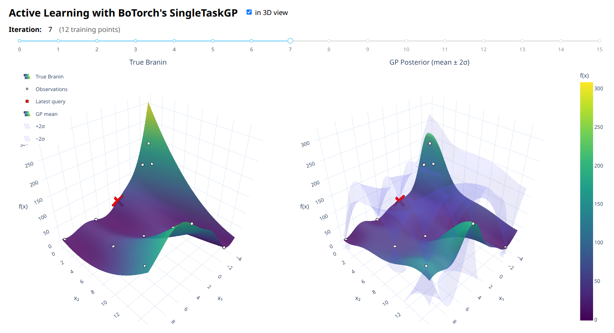

# Active Learning with BoTorch

An interactive educational example of **active learning** using
[BoTorch](https://botorch.org/)'s `SingleTaskGP` and a Dash web app for
visualisation.

## What is active learning?

In many real-world problems, evaluating the objective function is expensive
(physical experiments, long-running simulations, etc.).  Active learning
lets a surrogate model — here a Gaussian Process — **decide which point to
evaluate next** so that we learn the function as quickly as possible.

This project demonstrates a simple strategy called **uncertainty sampling**:
at each step we query the point where the GP is most uncertain (highest
posterior standard deviation).

## Project structure

```
.
├── active_learning_algorithm.py   # AL loop: fits the GP, picks queries, stores snapshots
├── active_learning_dash_app.py    # Dash app: visualises the snapshots interactively
├── requirements.txt               # Python dependencies
└── README.md
```

- **`active_learning_algorithm.py`** — contains the full active-learning
  loop.  It is imported (not run standalone) by the Dash app.  Heavily
  commented to serve as a learning resource.
- **`active_learning_dash_app.py`** — Dash web app that imports the
  pre-computed results and lets you scrub through iterations with a slider.
  Supports 2D contour plots and a 3D surface view.

## Quick start

```bash
pip install -r requirements.txt
python active_learning_dash_app.py
```

Then open http://127.0.0.1:8050 in your browser.

## What you will see

| View | Panels |
|------|--------|
| **2D** (default) | True Branin \| GP Posterior Mean \| GP Posterior Std Dev |
| **3D** (checkbox) | True Branin surface \| GP mean + confidence bounds |

- **White dots** — training observations collected so far.
- **Red X** — the most recently acquired point at that iteration.
- Use the **slider** to step through iterations and watch the GP learn.

### Things to notice

1. The **GP mean** converges toward the true Branin function as data
   accumulates.
2. The **GP std dev** starts large and shrinks — new queries always land
   in the brightest (most uncertain) regions.
3. In 3D, the translucent **confidence band** (mean +/- 2 sigma) tightens
   around the mean surface, especially near observed points.

## Configuration

Edit the constants at the top of `active_learning_algorithm.py`:

| Variable | Default | Description |
|----------|---------|-------------|
| `N_INITIAL` | 5 | Random points before AL begins |
| `N_ITERATIONS` | 15 | Active-learning steps |
| `GRID_RES` | 80 | Grid resolution for visualisation |
| `SEED` | 42 | Random seed for reproducibility |

## Key BoTorch concepts

- **`SingleTaskGP`** — single-output exact GP.
- **`Normalize` / `Standardize`** — built-in input/outcome transforms for
  well-conditioned fitting.
- **`train_Yvar`** — fixed observation noise (set to 1e-6 for a
  deterministic objective; omit to let the GP estimate it).
- **`PosteriorStandardDeviation`** — acquisition function for uncertainty
  sampling.
- **`optimize_acqf`** — multi-start L-BFGS acquisition optimiser.

## Note on AI

The whole thing has been put together with Claude Opus 4.6. 
I think it's roughly correct and shows a feasible way to implementing AL with BoTorch, but as always...
AI can make mistakes. Doublecheck things before you apply them.


